<h1 align="center">Overhacked!</h1>
<h2 align="center">(nwHacks 2026)</h2>

<h4 align="center">
  A cozy 2D pixel art hackathon game powered by agentic AI. <br>
  Solve coding challenges and race the clock to win together!
</h4>

<p align="center">
  <video src="https://github.com/user-attachments/assets/2e9fa9cf-fa4e-4b84-a2d3-502f0107b06f" width="500" style="max-width:500px;" controls></video>
</p>

<p align="center">
  <a href="https://devpost.com/software/overhacked">Devpost</a>
</p>

<br>

## Table of Contents
- [Contributors](#contributors)
- [Problem Statement](#problem-statement)
- [Overview](#overview)
- [Features](#features)
- [Tech Stack](#tech-stack)
- [How It Works](#how-it-works)
- [Technical Challenges](#technical-challenges)
- [Achievements](#achievements)
- [Future Improvements](#future-improvements)
- [Getting Started](#getting-started)

<br>

## Contributors
- Rain Lin
- Sam Lui
- Stephanie Xue
- Yuko Murayama

<br>

## Problem Statement

As CS students, attending hackathons is one of our favourite ways to meet new people, find like-minded collaborators, and bring a shippable MVP to life. That being said, you might end up meeting some people who are a bit too preoccupied with other priorities, like studying, grinding LeetCode, or applying for internships, which, to be fair, is completely valid. Inspired by the fast-paced gameplay of Overcooked, where players race against the clock to complete as many dishes as possible, we wanted to capture that same energy in a hackathon-themed experience. We wanted to create a game that not only mimics the chaotic energy of a hackathon environment, but also gives players a fun way to brush up on their programming knowledge through a variety of mini-games. From object oriented programming multiple-choice questions to interactive drag-and-drop challenges, Overhacked! has you covered.

<br>

## Overview

This project is a full-stack, web-based 2D pixel art hackathon game where players answer programming questions from their teammates to fill a progress bar before a two-minute timer runs out. Questions come in two main formats, multiple choice and drag and drop, both powered and personalized by agentic AI workflows based on information the player enters into a form at the start of the game. Multiple-choice questions are trivia style and test object oriented programming concepts without requiring the player to write any code, and answering correctly increases the progress bar by 25%. Drag-and-drop questions are hands-on code structuring exercises that also test object oriented programming concepts, and completing one correctly increases the bar by 50%. Players win by filling the progress bar before time runs out. The game is built with Next.js, React, TypeScript, HTML, and Tailwind CSS on the frontend, with Phaser.js serving as the game engine that powers scenes, player movement, and interactions. The backend uses FastAPI and Python, with OpenAI and CrewAI powering the agentic AI workflow that generates the personalized minigame questions and hints. The Zustand library manages state across the game's stores, and React Confetti renders a falling confetti animation when a player completes the game.

<br>

## Features

### Landing Page
Serves as the entry point to the game, designed with a clean, simple UI to quickly guide users into gameplay.

<p align="center">
  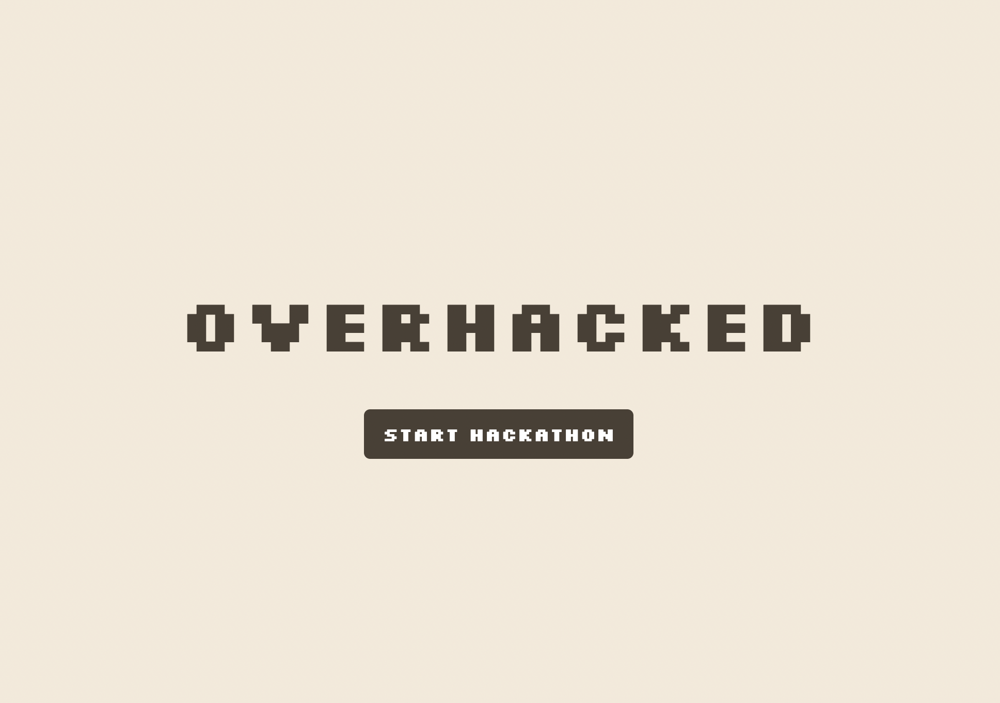
</p>

<br>

### User Form
Before entering the game, players fill out a form with the following information, which is passed to the backend to power adaptive gameplay:
- **Username**, displayed above the player's character in-game
- **Years of programming experience**, used by the agentic AI to adjust minigame question difficulty
- **Favourite programming language**, used to tailor minigame question generation

<p align="center">
  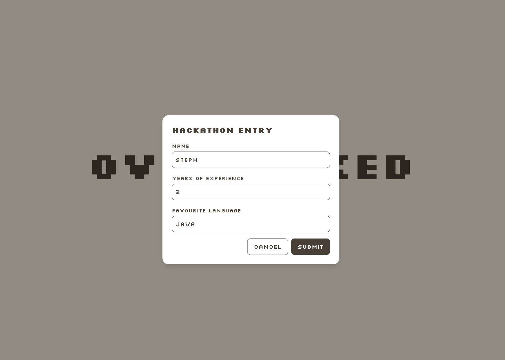
</p>

<br>

### Game Scene
The game takes place on a top-down 2D hackathon room, brought to life through a custom rendered pixel art background. Cute retro video game music loops continuously from the moment the scene loads.

- **Objective:**
  - A mentor instruction popup appears at the bottom right when the scene loads, explaining the objective: talk to teammates to help them with coding problems and fill the progress bar before time runs out
  - A two-minute countdown timer and progress bar are displayed at the top left, with the bar filling green as questions are answered correctly
- **Movement:**
  - The player's username is displayed above their character for personalization
  - Players move freely in all four directions using the arrow keys
  - Collision handling for tables and walls requires realistic navigation of the room
- **Teammate Interaction:**
  - Teammates are placed throughout the scene
  - Walking near a teammate brings up a prompt to press E and launch that teammate's assigned minigame, either multiple choice or drag-and-drop

<table align="center">
  <tr>
    <td>
      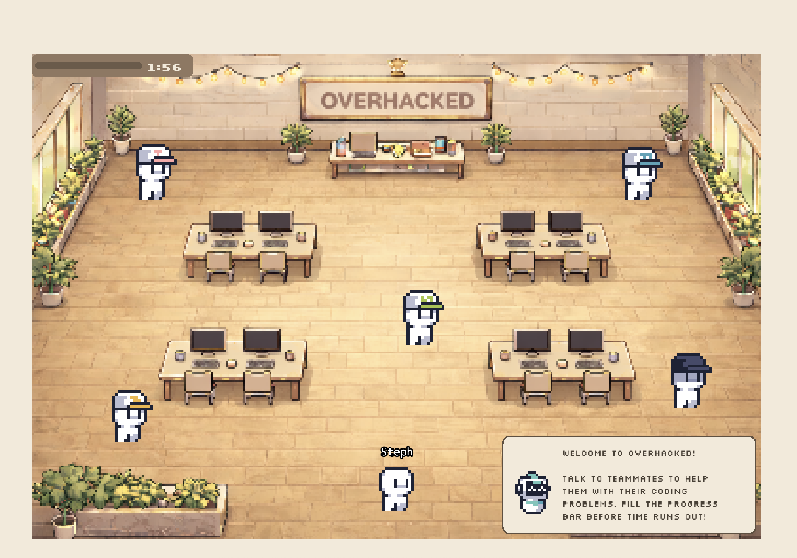
    </td>
    <td>
      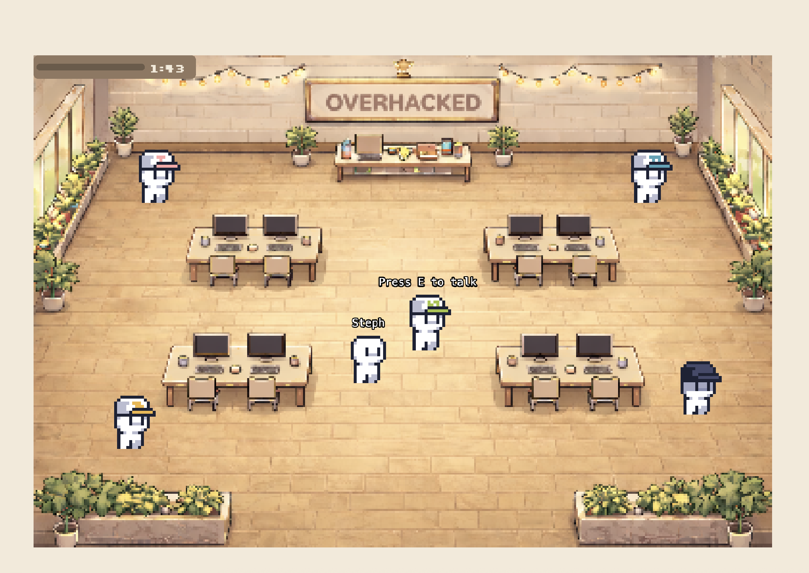
    </td>
  </tr>
</table>

<br>

### Mentor Popup Alerts
Mentor alerts appear randomly throughout gameplay at the bottom right, providing guidance, encouragement, or hints when players may be stuck. This adds a layer of realism and support, simulating mentor check-ins during a real hackathon.

<p align="center">
  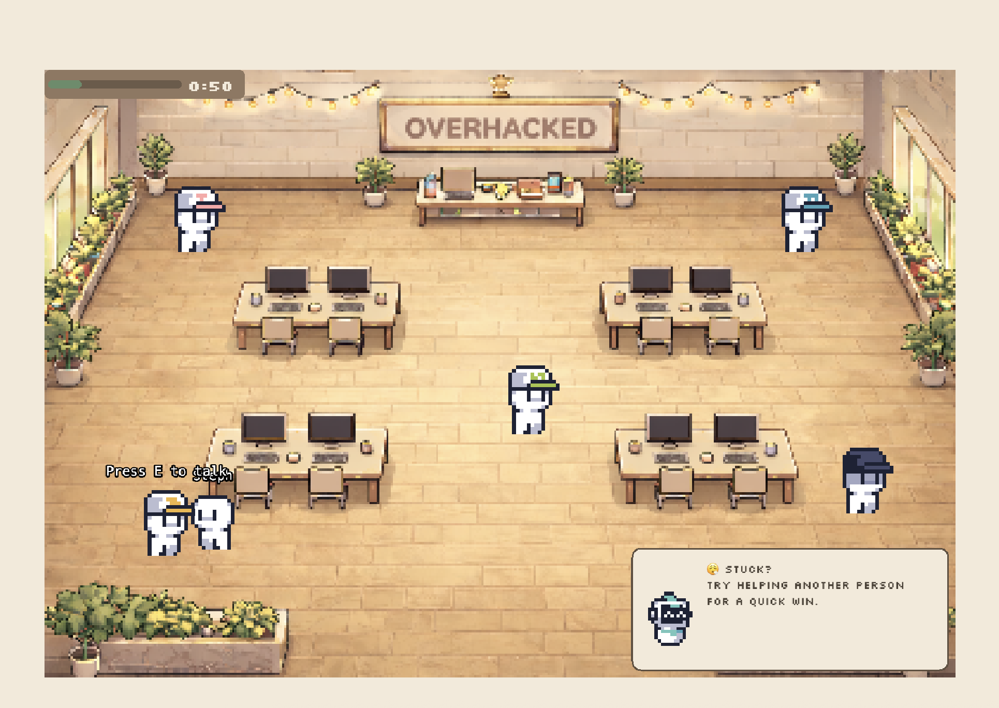
</p>

<br>

### Minigames
Both minigames follow a consistent structure. A loading screen appears while the agentic AI generates a personalized question, and a clickable mentor character remains available throughout to offer contextual hints. Every submitted answer is evaluated, with correct responses highlighted in green and incorrect ones in red. The two minigames differ primarily in question format and in how much each contributes to the overall progress bar.

**Multiple Choice**
- Trivia style question testing object oriented programming concepts
- Answering correctly increases progress by 25%

<table align="center">
  <tr>
    <td>
      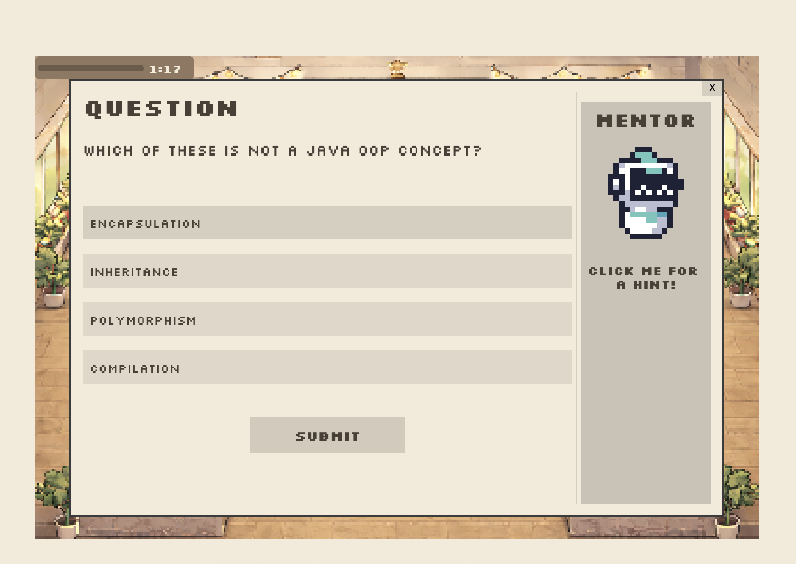
    </td>
    <td>
      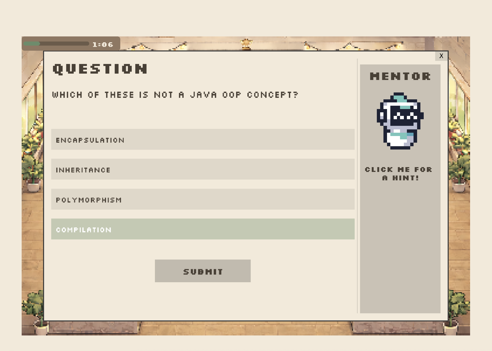
    </td>
  </tr>
</table>
<table align="center">
  <tr>
    <td>
      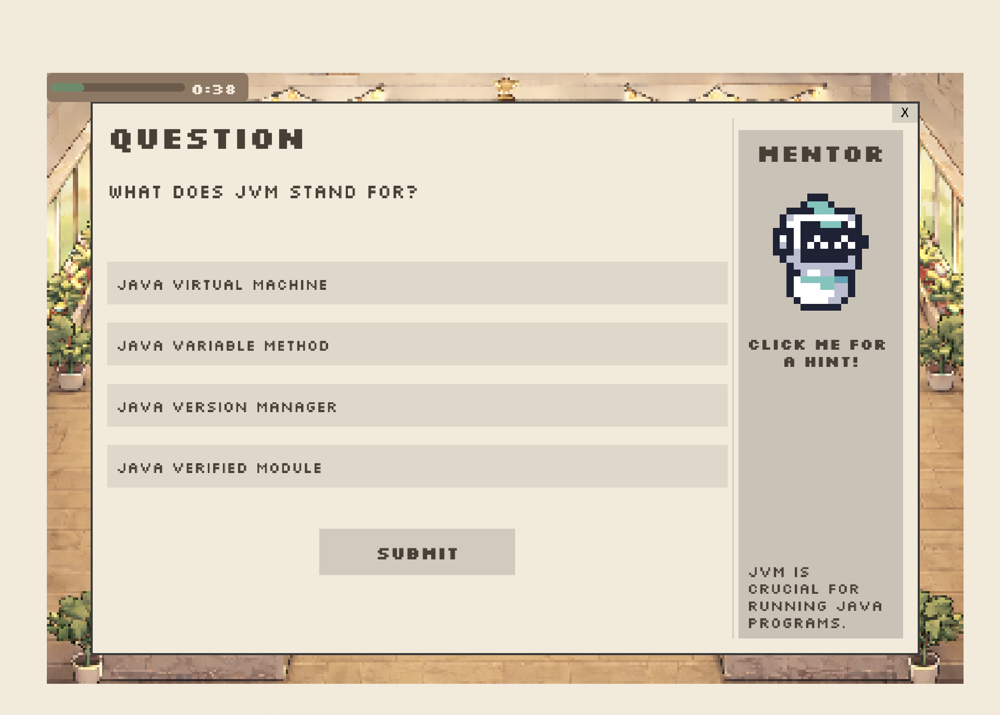
    </td>
    <td>
      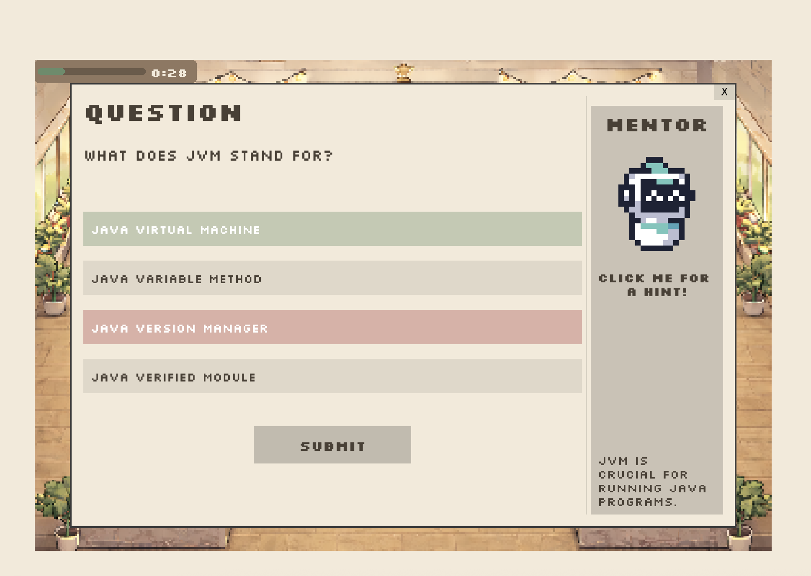
    </td>
  </tr>
</table>

<br>

**Drag and Drop**
- A more challenging, hands-on code structuring exercise requiring the player to arrange lines of code correctly, testing object oriented programming concepts
- Completing one correctly increases progress by 50%

<p align="center">
  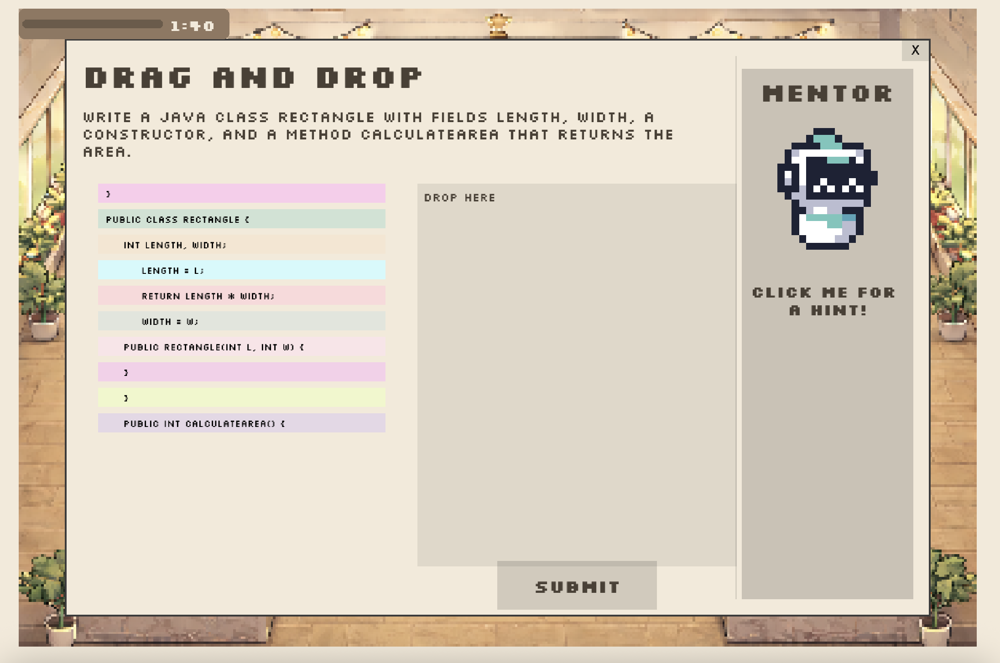
</p>
<table align="center">
  <tr>
    <td>
      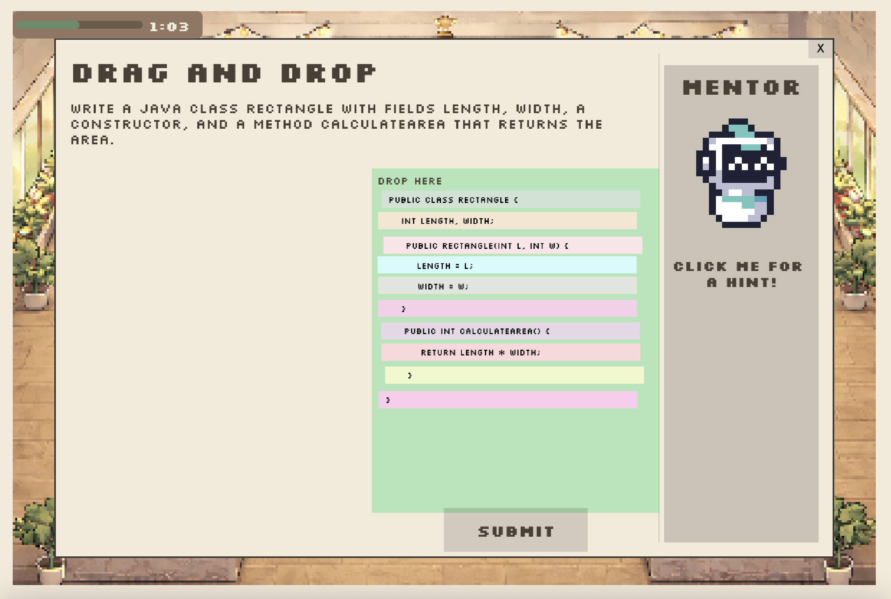
    </td>
    <td>
      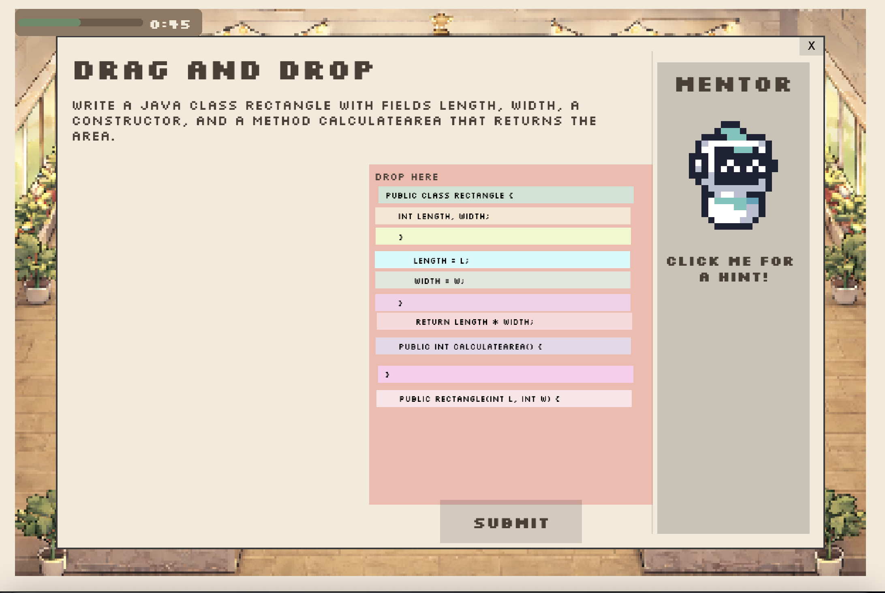
    </td>
  </tr>
</table>

<br>

### Victory Dialog
Triggered when the player fills the progress bar before the two-minute time limit, displaying a celebratory congratulations message alongside a confetti animation to reward the player for winning the hackathon challenge.

<p align="center">
  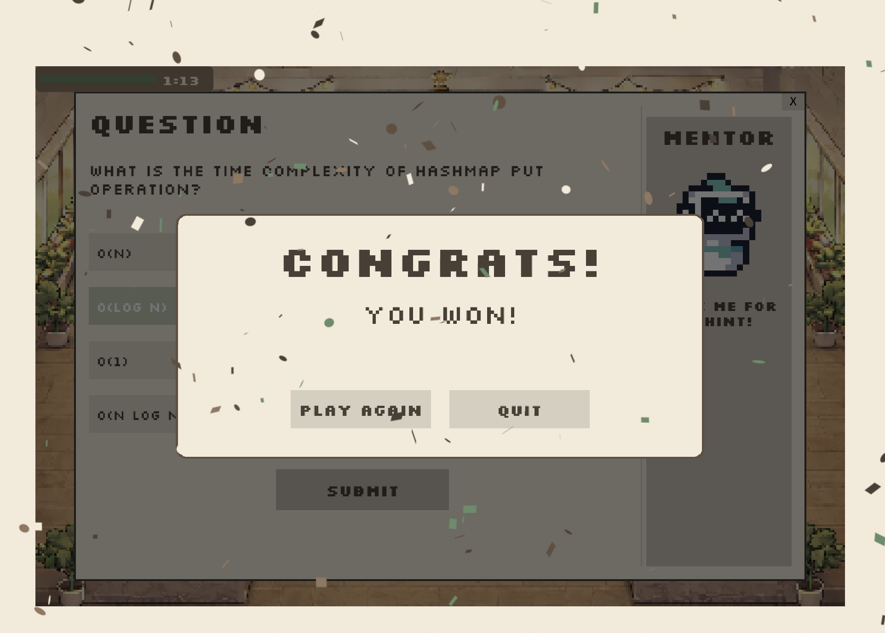
</p>

<br>

### Game Over Dialog
Triggered when the two-minute timer runs out before the progress bar is filled, displaying a game over screen to indicate the hackathon challenge was not completed in time.

<p align="center">
  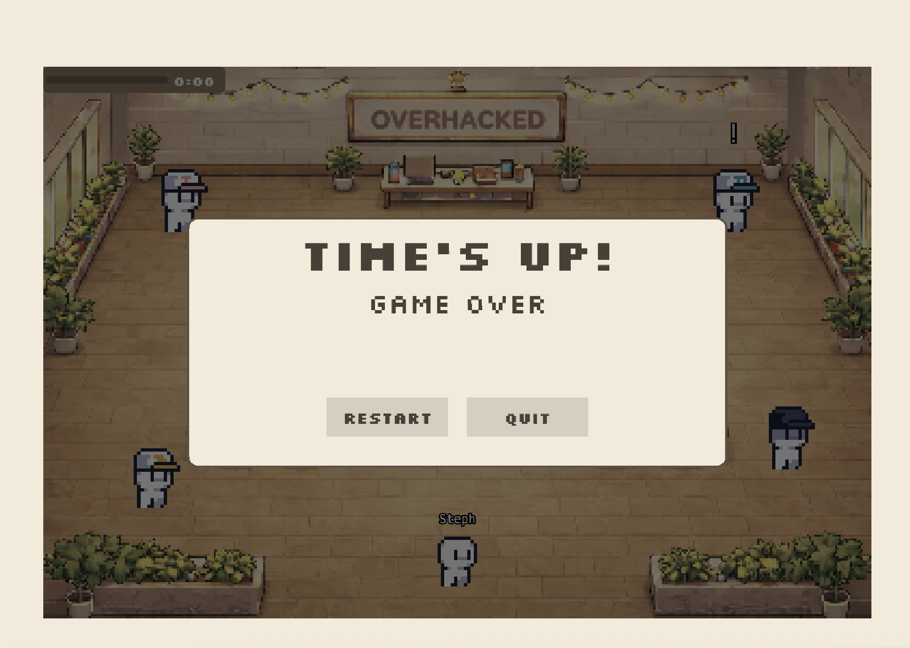
</p>

<br>

## Tech Stack

| Layer | Technologies |
|---|---|
| Frontend | Next.js, React, TypeScript, HTML, Tailwind CSS |
| Game Engine | Phaser.js |
| Backend | FastAPI, Python |
| Libraries | CrewAI (builds and runs the quiz and hint generating AI agents),<br>LangChain (connects the AI agents to OpenAI's models),<br>Zustand (manages state across the game's stores),<br>React Confetti (displays the win animation) |
| APIs | OpenAI GPT-4o (generates personalized quiz questions and contextual hints) |

<br>

## How It Works

### Frontend and Game Scene
The frontend is built with Next.js and React, with the core gameplay rendered through Phaser.js. The player and each NPC are rendered from individual sprite sheets, switching between walking and idle animations based on which arrow keys are held down. Tables and walls act as physical colliders, so the player is blocked from passing through them rather than simply overlapping visually. To detect when the player is close enough to talk to a teammate, the scene continuously measures the distance between the player and each NPC, and once that distance is small enough, it displays a prompt to press E and launches that NPC's minigame. Several Zustand stores hold state across the game, one for the user's form details, one for each minigame's questions and hints, and one for tracking which NPC the player is currently interacting with.

### Requesting a Minigame Question
When a player fills out the form at the start of the game, their name, years of experience, and favourite language are saved to a Zustand store and carried with them for the rest of the session. Walking up to a teammate NPC and pressing E triggers a request from the frontend to the FastAPI backend, sent as a POST request with the player's stored name, experience, and language as the payload.

### Generating a Question with Agentic AI
Each minigame has its own API route on the backend, and both routes use CrewAI to build two specialized agents that work together to generate content for each round:

- **Quiz Creator Agents** generate a personalized question, powered by OpenAI's GPT-4o model, tailored to the player's experience level and preferred programming language to adapt the difficulty of the minigame to their skill level.
- **Hint Agents** generate a series of contextual hints for that same question, helping players understand the underlying concepts without giving away the answer directly.

For the multiple choice route, the Quiz Creator Agent produces a trivia style question with four answer choices, testing object oriented programming concepts. For the drag and drop route, it instead produces a short, reorderable snippet of code testing the same kinds of concepts. Both agents' output is combined and returned as a single JSON response, which is parsed and validated against a Pydantic schema before being sent back to the frontend.

### Displaying Results and Tracking Progress
The frontend stores this response in the relevant Zustand store and displays it in the corresponding minigame dialog. Submitting an answer checks it against the correct answer included in the response, updates the player's progress in the active store, and provides immediate visual feedback by highlighting the result in green or red. The game scene reads the player's overall progress from these stores to fill the progress bar, triggering the victory dialog and a React Confetti animation once the bar is completely filled, or the game over dialog if the two-minute timer runs out first.

<br>

## Technical Challenges

- It was the first time using Phaser.js for everyone on the team. Integrating the game frontend with the backend APIs was particularly challenging, since some members focused primarily on UI while others focused on backend development
- It was also the team's first time using FastAPI, with a significant learning curve around defining clear schemas, naming them appropriately, and integrating them with agentic AI workflows

<br>

## Achievements

- Learned how to design and structure Phaser scenes, manage sprite sheets and animations, implement player movement and collision handling, and coordinate interactive elements such as NPC proximity triggers and UI overlays within a real-time game loop
- Successfully delivered a fully working MVP using several technologies that were completely new to the team, requiring a deep dive into core game mechanics such as scene management, player movement, collisions, state handling, and real-time UI updates
- Integrated Phaser scenes with a modern React and Next.js frontend while coordinating real-time interactions with AI-powered NPCs, requiring careful thought about architecture, performance, and user experience
- Improved development workflows and teamwork under a tight timeline, including becoming more comfortable with Git branching strategies, pull requests, and resolving merge conflicts

<br>

## Future Improvements
Several enhancements are planned to extend the functionality of the application:
- An AI game "master" that oversees the entire game, directing NPC agents to adjust question difficulty based on how quickly and accurately the player answers
- Improved AI response latency, since there is still some noticeable loading time between an NPC interaction and question generation
- Storing each user's quiz results to better personalize content and optimize question difficulty over time
- More real-life hackathon scenarios that affect gameplay, such as NPC dialogue, NPCs getting tired or distracted, fixing bugs in real-time, sudden typing tests, or disappearing teammates the player needs to find
- Additional subjects to study beyond object oriented programming, such as full-stack development, data structures and algorithms, and systems design
- Data persistence with a database to store user data and power a leaderboard of the highest scores
- More animated UI elements to increase player engagement

<br>

## Getting Started

Follow the steps below to set up and run the application on your own machine. This project requires both a frontend and a backend server running at the same time.

**Prerequisites**

Make sure Node.js, Python, and Git are installed before you begin. You can check each by running the commands below, which should print a version number.
```bash
node --version
python --version
git --version
```

**1. Clone the repository**

This downloads a copy of the project to your computer and moves you into the project folder.
```bash
git clone https://github.com/steph-xue/overhacked.git
cd overhacked
```

**2. Install the frontend dependencies**

This installs React, Next.js, and everything else the frontend needs to run.
```bash
cd frontend
npm install
```

**3. Start the frontend development server**

This runs the frontend locally.
```bash
npm run dev
```

Once the server is running, the frontend will be available at `http://localhost:3000`.

**4. Set up the backend environment**

In a new terminal, navigate to the backend folder and create a Python virtual environment.
```bash
cd backend
python -m venv venv
source venv/bin/activate      # On Windows use: venv\Scripts\activate
```

**5. Install the backend dependencies**

This installs FastAPI, CrewAI, and everything else the backend needs to run.
```bash
pip install -r requirements.txt
```

**6. Set up environment variables**

Create a `.env` file inside the `backend` folder with your OpenAI API key.
```bash
OPENAI_API_KEY=your_openai_api_key_here
```

**7. Start the backend server**

This runs the FastAPI backend using Uvicorn.
```bash
uvicorn main:app --reload --port 8000
```

Once both servers are running, the backend will be available at `http://127.0.0.1:8000`.
